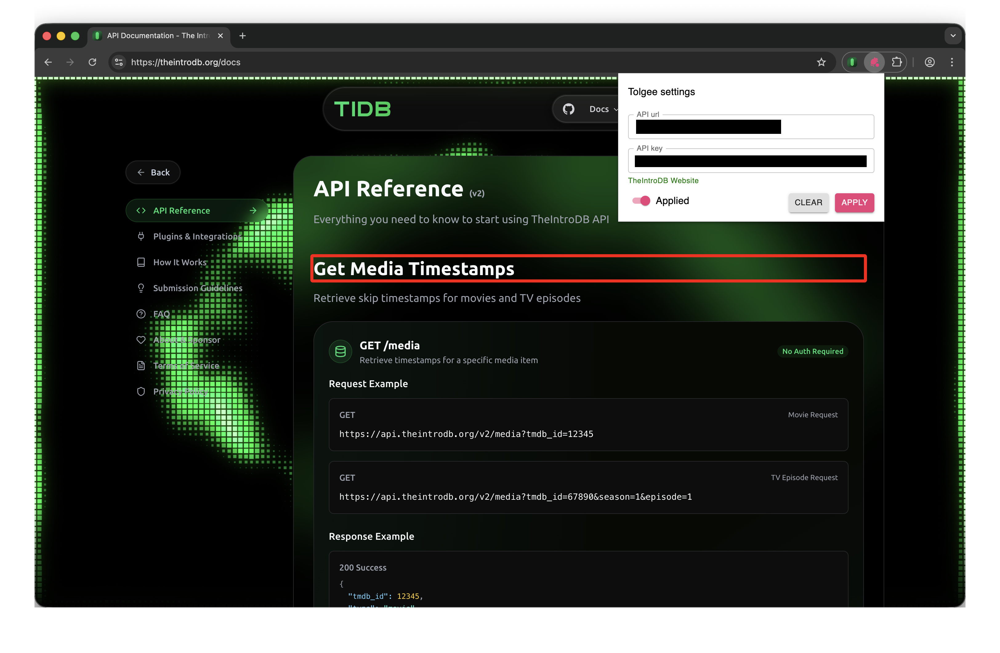
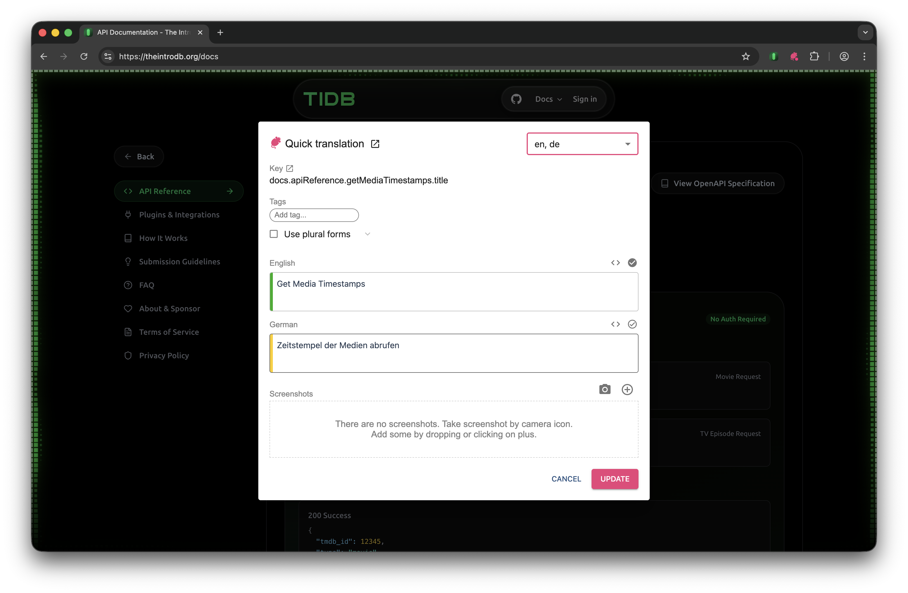

# Translating TheIntroDB

1. Integration Translations
2. Website Translations

## Integration Translations

TheIntroDB integrations such as plugins, addons, and browser extensions are maintained in their respective repositories

https://github.com/orgs/TheIntroDB/repositories

To edit or add translation files or strings for an integration, please open a pull request in the relevant repository.

## Website Translations

We use Tolgee to manage various translations for the website.

If you'd like to help translate the website, email [translate@theintrodb.org](mailto:translate@theintrodb.org) and include which language you would like to help translate.

Once you have been accepted, install the Tolgee Tools extension

[Chrome](https://chromewebstore.google.com/detail/tolgee-tools/hacnbapajkkfohnonhbmegojnddagfnj)
[Firefox](https://addons.mozilla.org/en-US/firefox/addon/tolgee-tools/)

Then:

1. Open the Tolgee Tools extension on the [website](https://theintrodb.org).
2. Go to the `Integrate` tab.
3. Select `React`.
4. Create an API key.
5. Apply the API key in the extension.

After that, hold `Alt` on Windows/Linux or `Option` on macOS and click any string on the page to open the translation menu.

